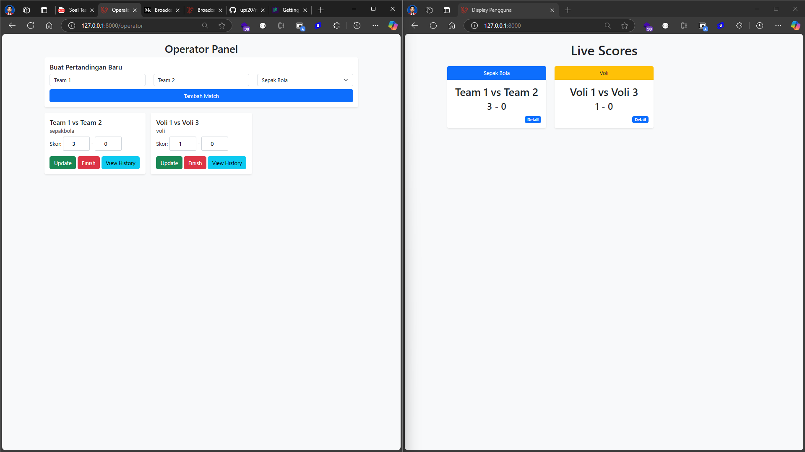

# Panduan Instalasi

Ikuti langkah-langkah berikut untuk mengatur proyek pada mesin lokal.

1. **Salin file:**

```bash
cp .env.example .env
```

2. **Masukkan kredensial Pusher di file:**

```env
BROADCAST_DRIVER=pusher
PUSHER_APP_ID=your-pusher-app-id
PUSHER_APP_KEY=your-pusher-app-key
PUSHER_APP_SECRET=your-pusher-app-secret
PUSHER_APP_CLUSTER=your-pusher-app-cluster
```

3. **Atur konfigurasi database di file:**

```env
DB_CONNECTION=pgsql
DB_HOST=127.0.0.1
DB_PORT=5432
DB_DATABASE=livescore
DB_USERNAME=postgres
DB_PASSWORD=
```

4. **Jalankan migrasi database dan isi data awal:**

```bash
php artisan migrate:fresh --seed
```

5. **Jalankan server pengembangan:**

```bash
php artisan serve
```

6. **Akses aplikasi:**

- **Display:** [http://127.0.0.1:8000](http://127.0.0.1:8000)
- **Operator:** [http://127.0.0.1:8000/operator](http://127.0.0.1:8000/operator)

Proyek sekarang sudah berjalan. Selamat coding!

